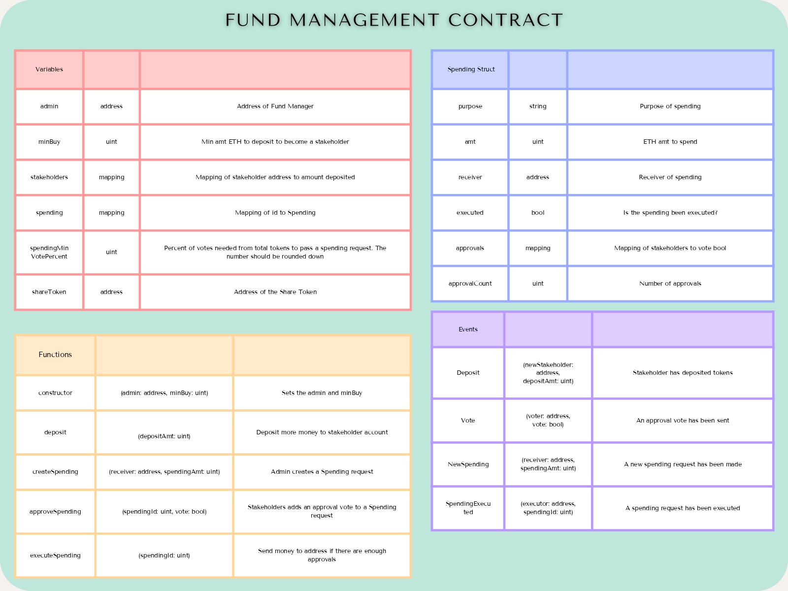
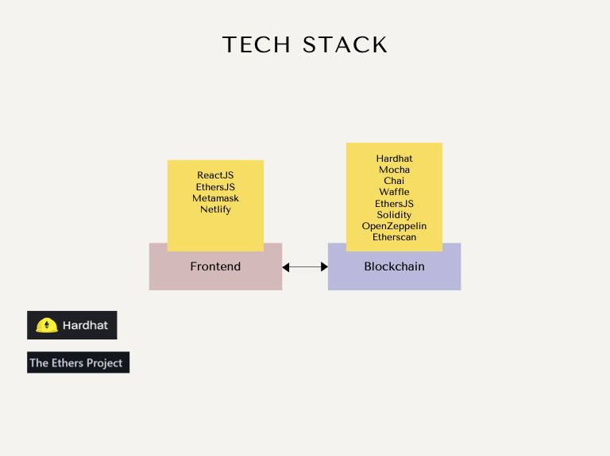

# Kickstarter dApp

This dApp allows people to deposit ETH into decentralized fund, and in return the fund will issue ERC20 tokens to represent the fund's shares. In other words, people can buy ERC20 tokens from the fund. The price is 1 FMD = 0.1ETH. The minimum ETH to spend to become a stakeholder is 0.1ETH. The ERC20 token can only be transferred from a shareholder to the Fund Management Contract.

The fund manager (admin) can create new spending requests in benefit of the fund, such as paying for building new software or hiring new employees. The stakeholders can then vote on such proposals. If the minimum approval votes (75% of all tokens) have been met, the admin can execute the spending, which send the ETH to a given address.

> Notice that DAOs can use a similar process to execute their code-related improvement proposals. e.g. Helium Improvement Proposals(HIP), Ethereum Improvement Proposals(EIP)

## Demo Instance

##### dApp Interface:

- Link: https://heartfelt-mooncake-8f0bf2.netlify.app/
- This dApp is served by the contracts described below.

##### Contract Addresses (Goerli Testnet):

- FundMangement contract:
  - [0xdDe00500B5b1eFD020CB622973de50D2FF7AF5F4](https://goerli.etherscan.io/address/0xdDe00500B5b1eFD020CB622973de50D2FF7AF5F4)

- FMDToken contract:
  - [0x07FBb3Ac8e6202E2d6a4020336BC63cb38161eE1](https://goerli.etherscan.io/address/0x07FBb3Ac8e6202E2d6a4020336BC63cb38161eE1)
- Admin address:
  - [0x67E7E4Bc1962470B70B5B6C9E95AE858B8Ab55E5](https://goerli.etherscan.io/address/0x67E7E4Bc1962470B70B5B6C9E95AE858B8Ab55E5)
- Deployed on Hardhat using Alchemy, FundMangement will create an ERC20 Token (FMDToken) contract after deployment.

## Contribution

##### Locations of unavoidable magic variables during setup:

- ADMIN_ADDRESS
  - location: `kickstarter-dapp/Smart-Contracts/scripts/deploy.js`
  - This address is required when constructing the FundManagement contract.
  - Since this account of this address will be the admin of the contract, it's hard for you to test the admin functions (CreateSpending and ExecuteSpending) using the [demo instance](## Demo Instance) without the private key.
    - Please test/deploy your instance.
    - The demo instance also contains some transaction history, including the execution of admin functions.
- GOERLI_PRIVATE_KEY
  - location: `kickstarter-dapp/Smart-Contracts/hardhat.config.js`
  - This address is required when deploying the smart contract on the Goerli network, but for testing purposes, it's not Contract Admin. Feel free to use it!

##### Known issue:

- Design choice: should disable ERC20 transfer from method from FMDToken to prevent Stakeholders from exchanging ERC20 tokens.

## Criteria

1. The Smart Contracts must be developed using the following Tech Stack.
2. The Solidity code must be fully documented.
3. The Smart Contracts must be tested with written test cases with clear documentation.
4. The Smart Contracts should be deployed on Goerli network and verified on [Goerli Etherscan](https://goerli.etherscan.io/). Use this [Hardhat plugin](https://hardhat.org/hardhat-runner/plugins/nomiclabs-hardhat-etherscan) to verify. 5.The frontend code should have a simple and organized UI. Take design inspiration from [Uniswap](https://app.uniswap.org/#/swap).
6. The website should be deployed to [Netlify](https://docs.netlify.com/get-started/).
7. The code should be uploaded to the course Github in 2 repos: Frontend and Smart-Contracts.

## Contract Specification

## Tech Stack 

Frontend:

- [ReactJS](https://reactjs.org/docs/getting-started.html): Frontend library to building Single Page Applications 
- [EtherJS](https://docs.ethers.io/): JS library used for integrating with EVM
- [Metamask](https://docs.metamask.io/guide/): A decentralized wallet used for interacting with ETH dApps. It also injects a free Infura Web3 Provider to interact with the blockchain
- [Netlify](https://docs.netlify.com/get-started/): Platform to host website

Blockchain: 

- [Hardhat](https://hardhat.org/hardhat-runner/docs/getting-started#overview): Framework for developing, testing and deploying Smart Contracts. Uses Mocha, Chai and Waffle
- [Mocha](https://mochajs.org/): helps document and organize tests with "describe", "it", etc
- [Chai](https://www.chaijs.com/): assertion library for testing with "expect", "assert", etc 
- [Waffle](https://getwaffle.io/): tools for compiling, deploying and testing smart contracts. It also provides extra Chai methods and can be added as an extension of Mocha
- [EthersJS](https://docs.ethers.io/): JS library used for integrating with EVM
- [Solidity](https://docs.soliditylang.org/): Language used to build smart contracts
- [OpenZeppelin Contracts](https://docs.openzeppelin.com/contracts): a library of well tested smart contracts, including ERC20
- [Etherscan](https://etherscan.io/): Block explorer

## Starter code design: 

- [David Liu](https://www.linkedin.com/in/davidliu134/)
- [Professor Sans](https://thierrysans.me/)

## Useful Links:

[Netlify: How to deploy React Apps in less than 30 Seconds](https://www.netlify.com/blog/2016/07/22/deploy-react-apps-in-less-than-30-seconds/)

[Hardhat & Alchemyapi: Deploying to a live network](https://hardhat.org/tutorial/deploying-to-a-live-network#7.-deploying-to-a-live-network)
